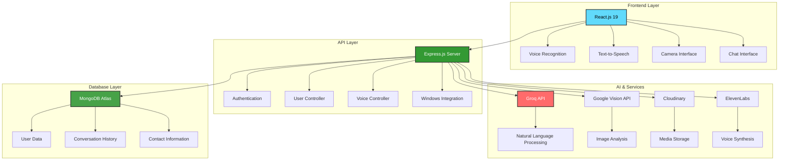
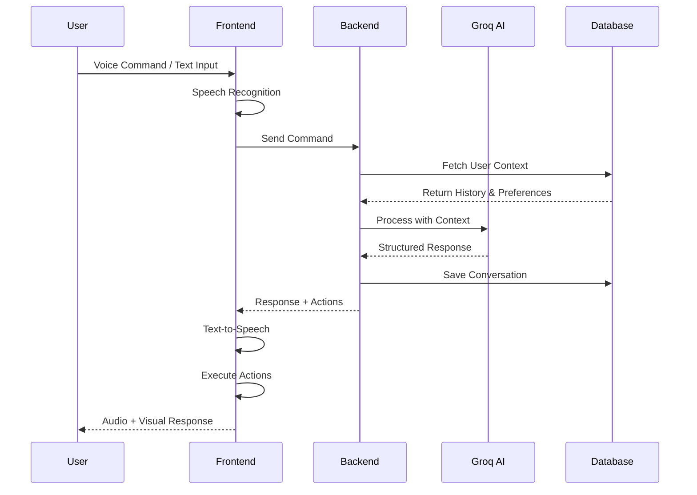

# 🤖 Intelligent Virtual Assistant

<div align="center">
  
  
  
  
  
</div>

<div align="center">
  <h3>🎤 Voice-Powered • 🧠 AI-Driven • 🌐 Multi-Language • 📱 Cross-Platform</h3>
  <p><em>An intelligent Virtual Assistant built with MERN stack that understands voice commands, processes natural language, and performs various tasks seamlessly.</em></p>
</div>

---

## 📋 Table of Contents
- [🎯 Overview](#-overview)
- [✨ Features](#-features)
- [🏗️ Architecture](#️-architecture)
- [🛠️ Tech Stack](#️-tech-stack)
- [🚀 Quick Start](#-quick-start)
- [📁 Project Structure](#-project-structure)
- [🎤 Voice Commands](#-voice-commands)
- [🔧 Configuration](#-configuration)
- [📸 Screenshots](#-screenshots)
- [🤝 Contributing](#-contributing)
- [📄 License](#-license)

## 🎯 Overview

The **Intelligent Virtual Assistant** is a full-stack web application that enables users to interact through voice commands and text input. Built with the MERN stack and powered by advanced AI, it supports multiple languages (English, Hindi, Marathi) and integrates with various web services to perform tasks like web searches, media playback, system commands, and more.

### 🌟 Key Highlights
- **🎤 Advanced Voice Recognition** - Multi-language speech recognition with wake word detection
- **🤖 AI-Powered Responses** - Natural language processing using Groq API (Llama 3.1)
- **🔊 Text-to-Speech** - Browser-based TTS with language-appropriate voices
- **🌍 Multi-Language Support** - Seamless English, Hindi, and Marathi support
- **📱 WhatsApp Integration** - Message monitoring and sending capabilities
- **📷 Visual Search** - Camera-based image analysis using Google Vision API
- **💾 Conversation Memory** - Persistent chat history with context awareness
- **🎨 Customizable Interface** - Custom assistant name, avatar, and voice selection

## ✨ Features

<table>
<tr>
<td width="50%">

### 🎤 Voice & Speech
- **Multi-language Recognition** (English, Hindi, Marathi)
- **Wake Word Detection** (Custom assistant name)
- **Sleep/Wake Functionality**
- **Confidence-based Filtering**
- **Feedback Loop Prevention**
- **Browser TTS Integration**

### 🤖 AI & Intelligence
- **Natural Language Processing** (Groq API)
- **Context-Aware Conversations**
- **Command Classification**
- **Personality-based Responses**
- **Memory System**
- **Multi-language AI Responses**

</td>
<td width="50%">

### 🌐 Web Integration
- **Google Search** automation
- **YouTube** video playback
- **Website Navigation**
- **Calculator** access
- **Screenshot** capture
- **Camera Control**

### 📱 Communication
- **WhatsApp** message monitoring
- **Contact Management**
- **Message Sending**
- **Call Initiation**
- **Notification Alerts**
- **Real-time Updates**

</td>
</tr>
</table>

## 🏗️ Architecture



### 🔄 Data Flow Architecture



## 🛠️ Tech Stack

<div align="center">

### Frontend
| Technology | Version | Purpose |
|------------|---------|----------|
|  | 19.0 | UI Framework |
|  | 5.0 | Build Tool |
|  | 3.4 | Styling |
|  | 1.11 | HTTP Client |

### Backend
| Technology | Version | Purpose |
|------------|---------|----------|
|  | 18.0 | Runtime |
|  | 5.1 | Web Framework |
|  | 8.16 | Database |
|  | 9.0 | Authentication |

### AI & Services
| Service | Purpose |
|---------|----------|
|  | Natural Language Processing |
|  | Image Recognition |
|  | Media Storage |
|  | Voice Synthesis |

</div>

## 🚀 Quick Start

### Prerequisites
- Node.js 18.0+
- MongoDB Atlas account
- Groq API key
- Google Cloud account (for Vision API)
- Cloudinary account

### Installation

1. **Clone the repository**
```bash
git clone https://github.com/premzade12/Virtual_Assistant.git
cd Virtual_Assistant
```

2. **Backend Setup**
```bash
cd backend
npm install
```

3. **Frontend Setup**
```bash
cd ../frontend
npm install
```

4. **Environment Configuration**

Create `.env` files in both backend and frontend directories:

**Backend `.env`:**
```env
# Database
MONGO_URI=your_mongodb_connection_string

# Authentication
JWT_SECRET=your_jwt_secret_key

# AI Services
GROQ_API_URL=https://api.groq.com/openai/v1/chat/completions
GROQ_API_KEY=your_groq_api_key

# Google Cloud
GOOGLE_PROJECT_ID=your_project_id
GOOGLE_PRIVATE_KEY=your_private_key
GOOGLE_CLIENT_EMAIL=your_client_email

# Media Storage
CLOUDINARY_CLOUD_NAME=your_cloud_name
CLOUDINARY_API_KEY=your_api_key
CLOUDINARY_API_SECRET=your_api_secret

# Voice Services
ELEVENLABS_API_KEY=your_elevenlabs_key

# Server
PORT=5000
```

**Frontend `.env`:**
```env
VITE_SERVER_URL=http://localhost:5000
```

5. **Start the Application**

```bash
# Terminal 1 - Backend
cd backend
npm run dev

# Terminal 2 - Frontend
cd frontend
npm run dev
```

6. **Access the Application**
- Frontend: `http://localhost:5173`
- Backend: `http://localhost:5000`

## 📁 Project Structure

```
Virtual_Assistant/
├── 📁 backend/
│   ├── 📁 config/
│   │   ├── 🔧 cloudinary.js      # Media upload config
│   │   ├── 🔧 db.js              # Database connection
│   │   └── 🔧 token.js           # JWT configuration
│   ├── 📁 controllers/
│   │   ├── 🎮 auth.controller.js  # Authentication logic
│   │   └── 🎮 user.controllers.js # User & AI logic
│   ├── 📁 middlewares/
│   │   ├── 🛡️ isAuth.js          # Auth middleware
│   │   └── 📤 multer.js          # File upload
│   ├── 📁 models/
│   │   └── 👤 user.model.js      # User schema
│   ├── 📁 routes/
│   │   ├── 🛣️ auth.routes.js     # Auth endpoints
│   │   ├── 🛣️ user.routes.js     # User endpoints
│   │   └── 🛣️ windows.routes.js  # System integration
│   ├── 📁 services/
│   │   ├── 🎤 elevenLabs.js      # Voice synthesis
│   │   ├── 🔊 voiceManager.js    # Voice management
│   │   └── 🖥️ windowsIntegration.js # System integration
│   ├── 🤖 groq.js               # AI processing
│   └── 🚀 index.js              # Server entry
├── 📁 frontend/
│   ├── 📁 src/
│   │   ├── 📁 components/
│   │   │   └── 🎴 Card.jsx       # Reusable components
│   │   ├── 📁 context/
│   │   │   └── 👤 UserContext.jsx # Global state
│   │   ├── 📁 pages/
│   │   │   ├── 🏠 Home.jsx        # Main interface
│   │   │   ├── 🔐 Signin.jsx      # Authentication
│   │   │   ├── 📝 Signup.jsx      # Registration
│   │   │   ├── ⚙️ Customize.jsx   # Assistant setup
│   │   │   └── ⚙️ Customize2.jsx  # Advanced setup
│   │   ├── 📁 utils/
│   │   │   ├── 📱 whatsappNotifications.js
│   │   │   └── 🖥️ windowsWhatsappMonitor.js
│   │   ├── 🎨 App.jsx            # Main app component
│   │   └── 🚀 main.jsx           # App entry
│   └── 📄 index.html             # HTML template
├── 📚 INTERVIEW_DOCUMENTATION.md  # Interview guide
├── 🌐 INTERVIEW_GUIDE.html        # Interactive guide
└── 📖 README.md                   # This file
```

## 🎤 Voice Commands

### 🔄 Basic Commands
```
"Hey [Assistant Name], search for React tutorials"
"Play some music on YouTube"
"What's the time?"
"Take a screenshot"
"Open calculator"
```

### 🌍 Multi-Language Examples
```
# English
"Open Instagram"
"Send message to John"

# Hindi
"समय बताओ" (Tell me the time)
"गूगल पर सर्च करो" (Search on Google)

# Mixed (Hinglish)
"YouTube पर गाना play करो"
"WhatsApp खोलो"
```

### 💤 Sleep/Wake Commands
```
"[Assistant Name], go to sleep"
"Wake up [Assistant Name]"
"Hey [Assistant Name]" (when sleeping)
```

## 🔧 Configuration

### 🎨 Customization Options
- **Assistant Name**: Personalize your assistant's name
- **Avatar**: Upload custom assistant avatar/video
- **Voice Selection**: Choose from available TTS voices
- **Language Preference**: Set primary language

### 🔐 Security Features
- JWT-based authentication
- bcrypt password hashing
- HTTP-only cookies
- CORS protection
- Input validation
- API key encryption

### 📊 Performance Optimizations
- Smart conversation history management
- Debounced voice recognition
- Efficient re-rendering
- Lazy loading components
- Optimized API calls

## 📸 Screenshots

<div align="center">

### 🏠 Main Interface
*Voice-activated assistant with real-time conversation*

### 🔐 Authentication
*Secure login and registration system*

### ⚙️ Customization
*Personalize your assistant's appearance and behavior*

### 📱 Mobile Responsive
*Fully responsive design for all devices*

</div>

## 🚀 Deployment

### 🌐 Production Setup

1. **Frontend Deployment** (Render/Vercel)
```bash
npm run build
# Deploy dist/ folder
```

2. **Backend Deployment** (Render/Railway)
```bash
# Set environment variables
# Deploy with Node.js runtime
```

3. **Database** (MongoDB Atlas)
- Configure connection string
- Set up indexes for performance
- Enable authentication

### 🔧 Environment Variables
Ensure all production environment variables are properly configured:
- Database connections
- API keys
- CORS origins
- JWT secrets

## 🤝 Contributing

Contributions are welcome! Please follow these steps:

1. Fork the repository
2. Create a feature branch (`git checkout -b feature/AmazingFeature`)
3. Commit your changes (`git commit -m 'Add some AmazingFeature'`)
4. Push to the branch (`git push origin feature/AmazingFeature`)
5. Open a Pull Request

### 🐛 Bug Reports
Please use the issue tracker to report bugs. Include:
- Browser/OS information
- Steps to reproduce
- Expected vs actual behavior
- Screenshots if applicable

## 📄 License

This project is licensed under the ISC License - see the [LICENSE](LICENSE) file for details.

---

<div align="center">
  <h3>🌟 If you found this project helpful, please give it a star! ⭐</h3>
  <p>Made with ❤️ by <a href="https://github.com/premzade12">Prem Zade</a></p>
  
  <p>
    <a href="https://github.com/premzade12/Virtual_Assistant/issues">Report Bug</a> •
    <a href="https://github.com/premzade12/Virtual_Assistant/issues">Request Feature</a> •
    <a href="#-quick-start">Documentation</a>
  </p>
</div>
